# SOC Automation Lab Project
This SOC automation lab simulates how a security team detects, manages, and responds to alerts. Wazuh is used as the SIEM, TheHive is used for case management, and Shuffle is used as the SOAR to automate the workflow. The lab demonstrates endpoint telemetry, alert generation, case creation, analyst notification, and basic incident response automation.


# Lab Objectives
1. Simulate a SOC workflow from detection to investigation and response
2. Configure Wazuh as the main SIEM/XDR platform (using Azure)
3. Configure TheHive as the case management platform (using Azure)
4. Configure Shuffle as the SOAR
5. USe Mimikatz in a Windows VM to generate malicious telemetry  
6. Use logs from Sysmon

# Lab Roadmap
Basic Flow:
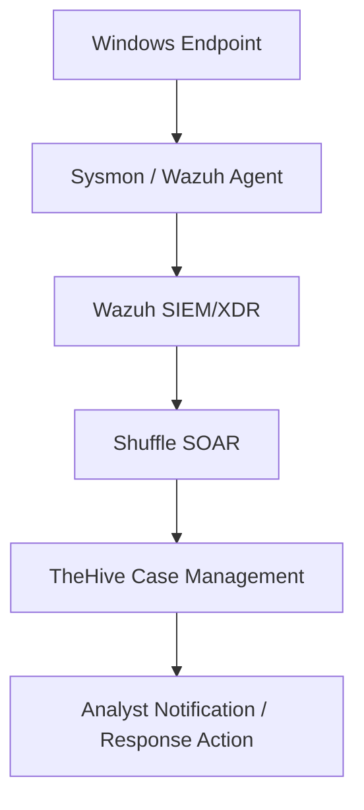

Activity on the Windows endpoint is captured by Sysmon and the Wazuh agent, which send logs to the Wazuh SIEM/XDR for analysis and alert generation. Alerts are then passed to Shuffle, which automates workflows such as creating cases in TheHive. Finally, TheHive organizes the incident for investigation and can trigger notifications or response actions by the analyst.

## Lab Sections
This lab is divided into 4 sections, namely:
### Section 1: Platforms and Endpoint Preparation

Azure virtual machines are created for Wazuh and TheHive, SSH access was configured to configure them. Shuffle is also set up as the SOAR.

### Section 2: Server and Endpoint Configuration

Wazuh, TheHive, and the Windows endpoint are configured so they can communicate with each other.

### Section 3: Telemetry and Alert Generation

This will involve generating endpoint telemetry utilizing Mimikatz and Sysmon and creating alerts in Wazuh.

### Section 4: SOAR Integration and Automation

Integrating Wazuh, TheHive, and Shuffle to automate alert handling, case creation, analyst notification, and possible response actions.

# Section 1: Platforms and Endpoint Preparation
## 1.1. Setup Windows 11 Virtual Machine
A Windows 11 Pro Virtual Machine has been setup in VirtualBox.


Sysmon has also been setup and configured in this VM.


## 1.2 Setup of Wazuh and TheHive in Microsoft Azure  
### 1.2.1 Setup a Resource Group
For this lab Wazuh and TheHive are hosted in Microsoft Azure for convenience and to free up resources in the local machine, as it is already running the Windows VM locally. 

A resource group named "soc-lab-rg" is set up. All our resources including the Wazuh and TheHive servers will be stored here, as well as the virtual networks.


### 1.2.1 Wazuh Server Deployment
For the server that will host Wazuh, an Ubuntu 24.04 LTS VM was deployed. Named wazuh-server and was deployed to have 4 vCPUs and 8 GBs of RAM. This server will host our SIEM/XDR. Initially, SSH is enabled within the network settings of this VM to allow access to the VM using our local machine.

We can take note of the assigned public IP address for this server which is:
    
    Wazuh Server Public IP: 20.205.120.231


### 1.2.2 TheHive Server Deployment
For the TheHive server, a slightly more powerful Ubuntu 24.04 LTS VM was with 16 GB of RAM was used since TheHive requiers heavier backend components and is used for investigation and case tracking. This VM was named thehive. Like the Wazuh server, SSH is also enabled initially for this VM.

We can also take note of the assigned public IP address for this server which is:

    TheHive Server Public IP: 20.89.254.38


## 1.3 SSH Access to Azure-based VMs and Update Ubuntu.

### 1.3.1. Acesss Azure VMs using SSH
To access our Azure VMs from our local machine, we can use secure shell or SSH. An SSH key-based authentication was set up to ensure a secure connection.

SSH key-based authentication uses a pair of cryptographic keys: a private key stored securely on the local machine and a public key placed on the server. When connecting, the server verifies the private key without transmitting it over the network. This approach is more secure than password-based authentication.

To SSH onto our Azure VMs, we can use the command:

    ssh -i <PRIVATE_KEY_FILE>.pem <USERNAME>@<SERVER_PUBLIC_IP>

We used Windows Powershell to enter this command to access both servers. The default username for these is "azureuser". It's also important that when performing this command, we must be in the same directory as the .pem or SSH key. As shown in the screenshots below.


SSH to the Wazuh Server:


SSH to TheHive Server:


### 1.3.2 Ubuntu Updates
Now that we have SSH connection to both our VMs, we can go ahead and update our Ubuntu package repositories. 

We can use the command:

    sudo apt update && sudo apt upgrade -y

 - sudo: Runs the command with administrative (root) privileges
 - apt update: Refreshes the package list from repositories
 - &&: Ensures the next command runs only if the previous one succeeds
 - apt upgrade: Installs available updates for installed packages
 - -y: Automatically confirms prompts to proceed with the upgrade

Wazuh Server Update:


TheHive Server Update:


With this SSH connection and Ubuntu updates, we now have an established connection from our local machine to our updated VMs that we configured earlier in Azure. We can now install our platforms in these VMs and configure them.

## 1.4 Wazuh Installation
Wazuh was installed on the Azure Ubuntu server using the Wazuh installation assistant.

The main command used is:

    curl -sO https://packages.wazuh.com/4.14/wazuh-install.sh && sudo bash ./wazuh-install.sh -a

The screenshot below shows that Wazuh has already been installed. This is because I have already installed Wazuh previously, but no harm in still entering the command.


Wazuh will be used as the main SIEM/XDR component of the lab. It will collect logs, analyze events, and generate alerts from monitored endpoints.


## 1.5 TheHive Installation
Unlike Wazuh, installing TheHive requires more steps.

For the brevity of this document, refer to TheHive website for instructions for steps 1.5.1 - 1.5.4. 

### 1.5.1 Install required dependencies

### 1.5.2 Set up the Java virtual machine (JVM)

### 1.5.3 Install and configure Apache Cassandra

### 1.5.4 Install and configure Elasticsearch

### 1.5.5 Install and configure TheHive
With the previous pre-requisites being installed, we can now download the installation packages for TheHive and finally  install it.

To Install TheHive, use the command:

    sudo apt-get install /tmp/thehive_5.7.3-1_all.deb

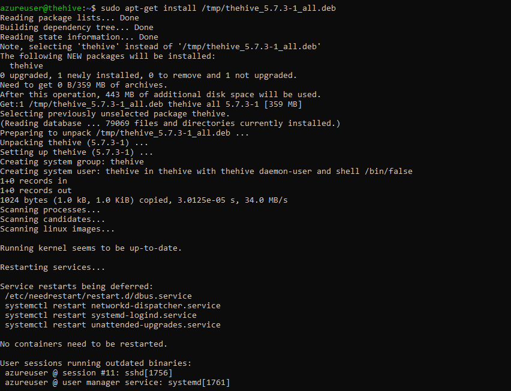


## 1.6 Logging Into Wazuh and TheHive
Now that Wazuh and TheHive have been installed, we can try logging into them using our browser.

To login to our Wazuh Server using our web broswer we can simply type in

    https://[WAZUH-SERVER-PUBLIC-IP]

Which for our case is https://20.205.120.231/

However, upon trying this, we can see that we get a timeout error. Meaning our browser cannot connect to our Wazuh Server
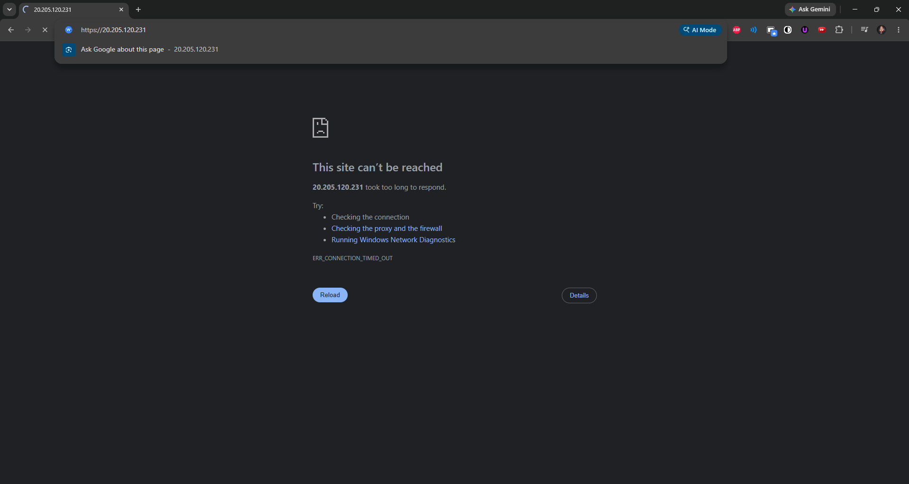

To login to our TheHive on the other hand, we can type in

    http://[THEHIVE-SERVER-PUBLIC-IP]:9000

However, like our Wazuh Server, this is giving us a timeout error.
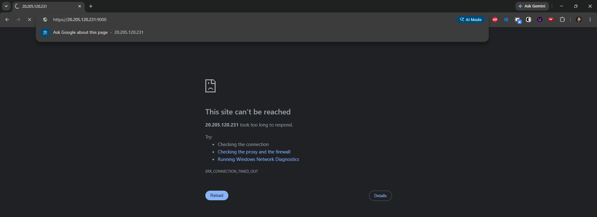

So we must troubleshoot to figure out what is causing this and fix the issue.

### 1.6.1 Troubleshooting Wazuh and TheHive Servers

### 1.6.1.1 Firewalls

The first thing to check if there is a Firewall set up in our virtual network within Azure.

To do this we can simply go to Azure Portal -> Virtual Networks -> [virtual-network] -> Settings -> Firewall

For both our Vnets, there are no firewalls that exist. So we can eliminate this potential cause.

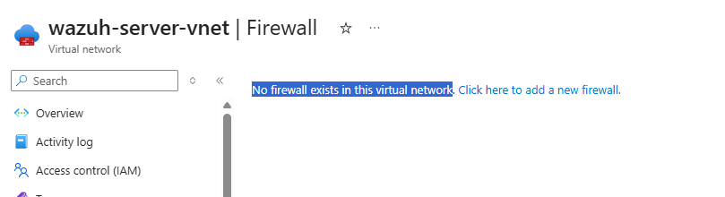

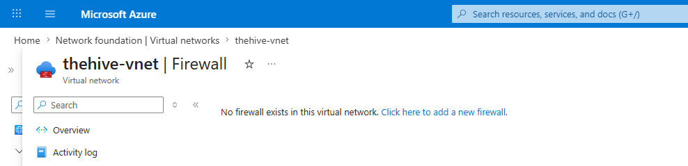 


### 1.6.1.2 Check if Services are Running

A possible reason for our timeout is simply that Wazuh and TheHive are simply not running. We can verify these services are running using the commands: 

    systemctl is-active <service-name>

 - systemctl = controls/checks Linux system services.
 - is-active = checks if a service is currently running.
 - service-name = the service you want to check, like thehive, cassandra, or wazuh-manager.
 - active = service is running.
 - inactive = service is installed but not running.
 - failed = service tried to run but encountered an error.

This checks whether a Linux service is currently running.

For the Wazuh server, we can see that the Wazuh services are running, so no issue here.  

Verifying if Wazuh service is running:
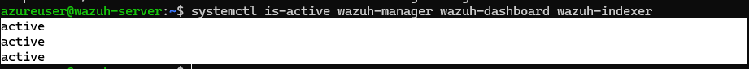

Also for the TheHive server, we can see that all the required services are running.

Verifying that TheHive service is running:


So we have confirmed that the services are actively running, so we can eliminate this potential issue.

### 1.6.1.3 Verify if HTTPS port is Enabled
Another possible cause of the timeout issue is that HTTPS traffic is not allowed in our Azure Network Security Groups. Since the Wazuh and TheHive dashboards are accessed through HTTPS, port 443 must be enabled. If this inbound port is blocked, the browser will not be able to reach the Wazuh and TheHive servers even if the services are  running properly and no firewalls are set up.


To do this we can configure our VM network settings in Azure. Go to Azure Portal -> Virtual Machine -> Network Settings

Inspecting our current network settings, we can see that SSH or port 22 is the only inbound port enabled. No wonder we can't connect to our Servers via HTTPS, but can access it via powershell using SSH.
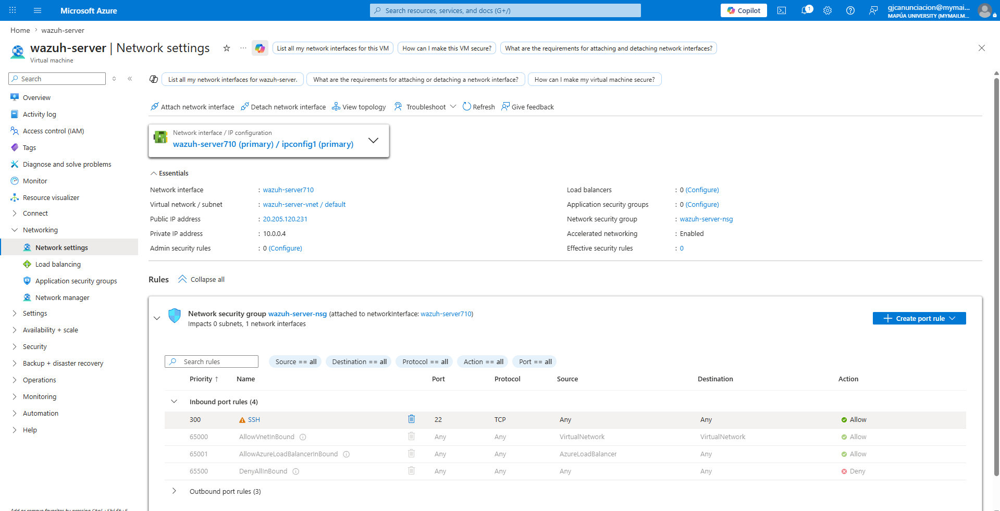

Our inbound port rules for TheHive VM, the same issue exists. So the next step is to simply add a rule to allow inbound HTTPS (port 443) traffic, to be safe we can also enable HTTP (port 80).

In the same window, we can simply click on "Create port rule" and configure our settings.
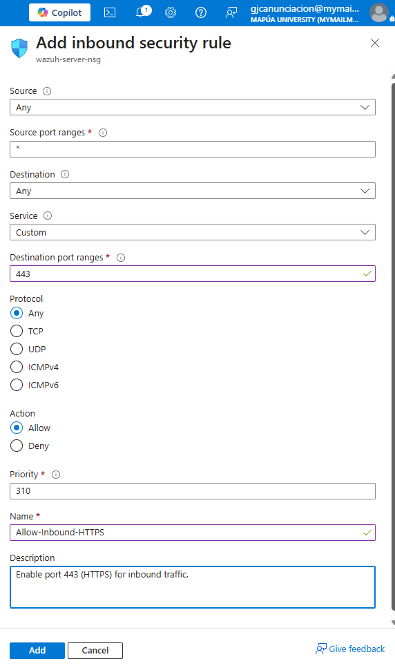

Now, we can see that inbound traffic to port 443 or HTTP has been enabled for the network group. 
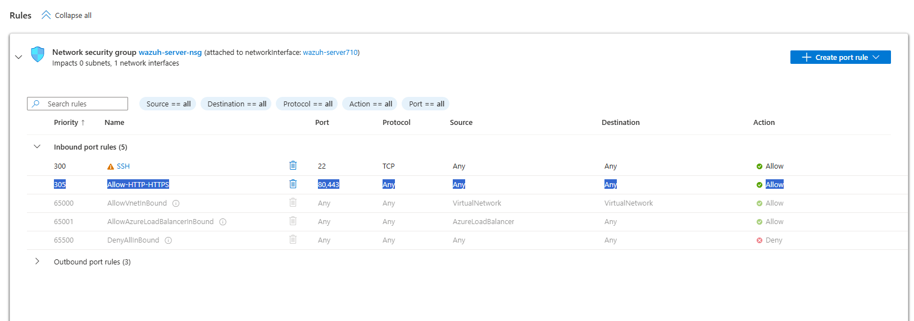

We can perform the same configurations for the TheHive VM. 

### 1.6.2 Check if we can now login to Wazuh and TheHive

Entering https://[WAZUH-SERVER-PUBLIC-IP] onto our URL field in our browser, we can now access our Wazuh server. 

We have successfully troubleshooted our timeout error earlier for our Wazuh Server. The cause of the problem was that inbound HTTPS traffic was blocked in our VMs' network security groups. Enabling this port solved our problem. 

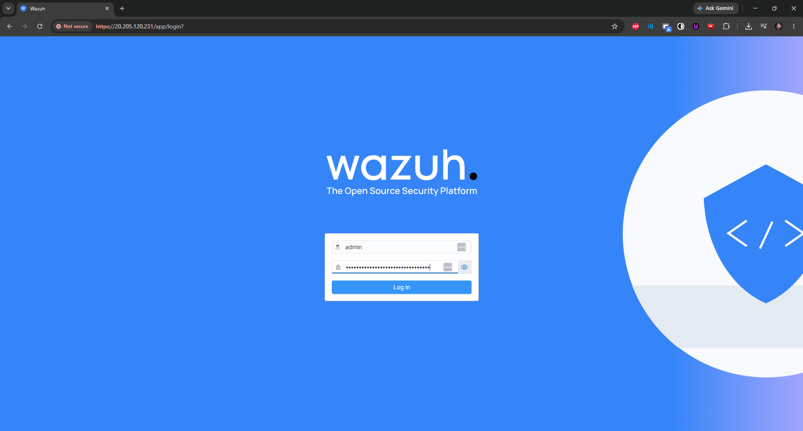

Although for now, we still can't access TheHive through our browser, a timeout error still persists at this point. That is because additional configuration must still be done, which we will be doing in the next section

# Section 2: Servers and Endpoint Configuration

This section focuses on configuring the deployed servers and endpoint so they can begin communicating with each other.

## Section 2.1: Configure TheHive
In this section of the lab, we will configure TheHive and its required backend services (Cassandra and Elastisearch) so it can function as the case management platform for our SOC environment. We will update Cassandra, Elasticsearch, and TheHive’s application configuration to use the correct server settings.

### Section 2.1.1 Configuring Cassandra for TheHive

To configure Cassandra, we must first open it's main configuration file, using the command:

    sudo nano /etc/cassandra/cassandra.yaml

 - sudo = run as admin/root
 - nano = text editor
 - cassandra.yaml = Cassandra config file

 We can now change our "cluster_name" to personalize it. For this lab, I just chose to name it "JethLabCassandra"

 

 Then we can change our Listening Address, since the Cassabdra .yaml configuration file contains hundreds of lines, to make our work easier, we can use "Where Is" to find the word listen in our conf file, using the hotkey "^W". 
 
    Note: For this Azure deployment, we use the private IP for Cassandra, Elasticsearch, and TheHive's internal configurations because these services communicate internally on the Azure VM. The public IP is only used for external access from the browser, while the private IP is the actual address assigned inside Ubuntu.

 
 We can change our listen_address from "localhost" to the private IP address of our TheHive Server which is "10.0.0.4"

 This tells Cassandra what network address to listen on.

 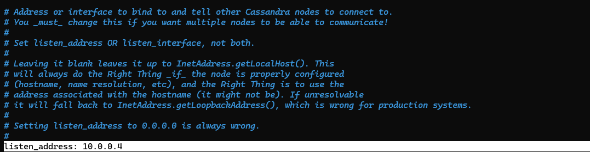
 
 Next we must change our rpc_address, using the same hotkey ("^W"), to find it in our config file. We must also change this to the private IP address of the TheHive server.

 RPC is how applications, like TheHive, communicate with Cassandra.

 

Lastly, we must configure our seed. Again, we just change this to the private IP address, but maintaining the default port.

The seed tells Cassandra where the main node is. Since this is a single-server lab, it points to itself.

 

 Now we can finally save our cassandra configuration file by pressing ^X to exit, then Y to save the file, then just press enter. 

 To properly implement our changes, we must first stop the cassandra service, using the command
    
    systemctl stop cassandra.service

This stops Cassandra before applying the new config.

 - systemctl = manages Linux services
 - stop cassandra = stops the Cassandra service

 Then we must remove the old Cassandra database files. We must do this  because changing the cluster name can conflict with the old stored data.


    sudo rm -rf /var/lib/cassandra/*

 - sudo = runs the command with administrator/root privileges.
 - rm  = removes/deletes files or folders.
 - -r = deletes folders and everything inside them.
 - -f  = force deletes without asking for confirmation
 - /var/lib/cassandra/*  = targets all contents inside Cassandra’s data directory, but not the folder itself.

 Now we can start the Cassandra service using the command

    systemctl start cassandra.service

Which is similar to the previous stop command, but changing "stop" for "start". This simply starts the service. 

Then we can verify the status of our service using

    systemctl status cassandra.service


### Section 2.1.2 Configuring Elasticsearch for TheHive

Similar to our Cassandra configuration, we must first open the elasticsearch config file. We can use the command

    nano /etc/elasticsearch/elasticsearch.yml

Again, like in our Cassandra config, the next step is to change our cluster name. 
We can uncomment the cluster-name line and rename it. To follow our previous naming style in Cassandra, I'm just going to rename this as JethLabElasticsearch 

We must also uncomment the node.name line. This names this Elasticsearch server as node-1. Since this is only one VM, one node is enough.

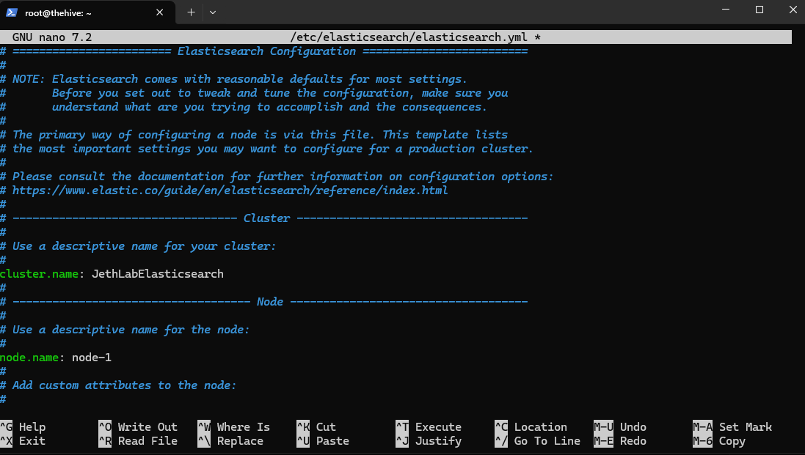

Next, we must configure our Network settings. First is to uncomment the network.host line and configure it to our private IP. This tells Elasticsearch what IP address to listen on. 

We must also uncomment the http.port line, this sets the default port of 9200  (the API port) which TheHive will use to talk to Elasticsearch.


Lastly is to configure our cluster, after uncommenting this line, we can remove "node-2" and just leave "node-1" alone. We do this since we only need to have one Elasticsearch node.

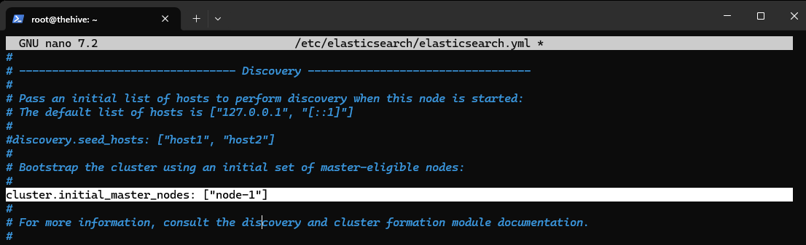

Then again just save this file by pressing ^X to exit, then ^Y to save, then press Enter to save the filename.

After editing our configuration file, we can now start and enable our elasticsearch service. Then check the status of this service. Using the same commands as we did during the Cassandra config, but of course, using elasticsearch as the service name in our commands.

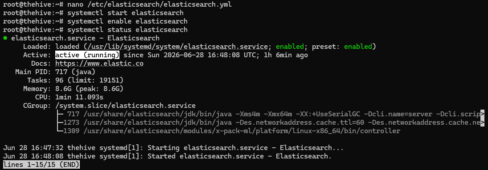

### Section 2.1.2 Configuring TheHive

Before proceeding we must change the TheHive directory ownership, which is stored in /opt/thp.

Inspecting this directory, by first using "cd" to change to that directory, then using "ll" to list its contents. We can see that the thehive directory is currently owned by "root root".

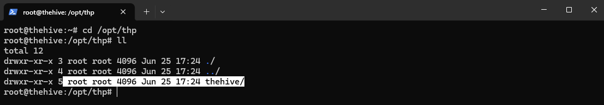

We must change this to be owned by "thehive", because currently this directory is only allowed access to the root. This command changes the permissions to the /thp folder, and will allow the TheHive service to properly access its own files.

    chown -R thehive:thehive /opt/thp

 - chown = change owner
 - -R = applies changes to all files/folders inside. Thus changing permissions for the "thehive" directory inside /thp
 - thehive:thehive = owner and group should be thehive
 - /opt/thp = TheHive program directory

 Using the command "ll" to list the contents of this directory again, we can verify that the permissions for the "thehive" directory has been changed to thehive.

 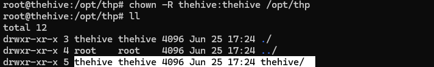

Now that the directory permissions has been configured. We can now perform the actual configurations for the TheHive service.

Again, like the two previous services, we can edit the TheHive's config file using "nano" and specifying the config file's location. 

    nano /etc/thehive/application.conf

And similar to our previous configs, we must change the hostname to this server's public IP address. 

For Cassandra under this config file, we must set the cluster name to match the previous, which is "JethLabCassandra". 

And also for the Elasticsearch under this config file, the hostname must be set to our private IP address.


Lastly, we must change the service's application base url by inputting the public IP address and maintaining the default port of 9000. This is the URL we will use later to access TheHive in our browser.


Then again simply exit and save the config file. 

With the service being configured, we can start and enable it, then verify its status using again "start", "enable", "status" commands, as we used previously.

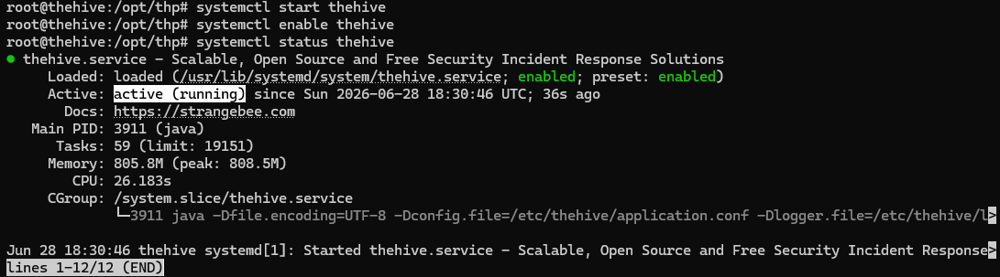

Lastly, since we know access to the TheHive uses port 9000, we must allow this using the ufw tool.

We allow port 9000 through UFW because TheHive uses port 9000 for its web interface. Even if TheHive is configured properly and its required services are running, the browser won't be able to reach it if the server firewall blocks inbound traffic on that port.

    ufw allow 9000

 - ufw = Ubuntu’s firewall tool
 - allow = create a rule that permits traffic
 - 9000 = allow TCP traffic on port 9000

And now finally we can access TheHive. We can use the default credentials from TheHive's website.
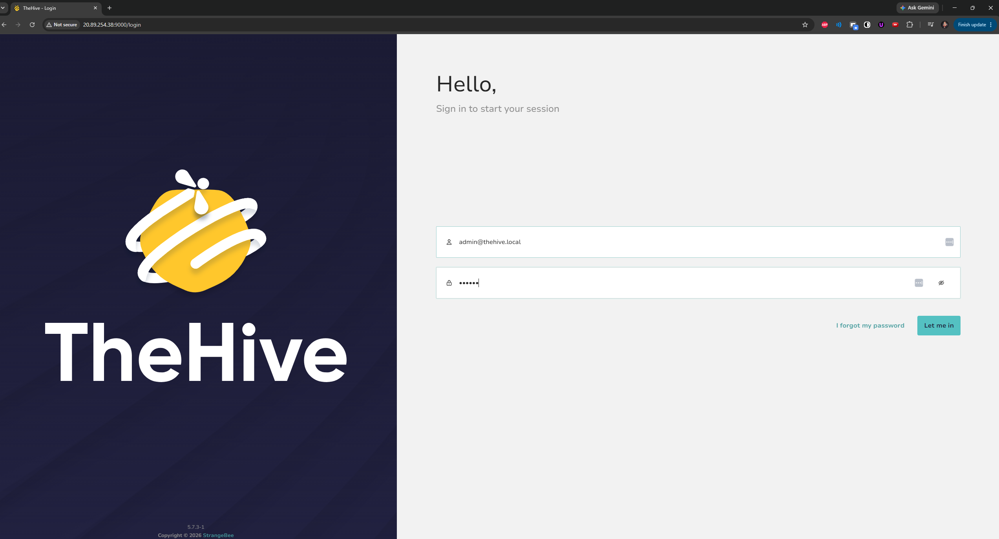

After signing in, we are greeted with the Organisation List of TheHive.
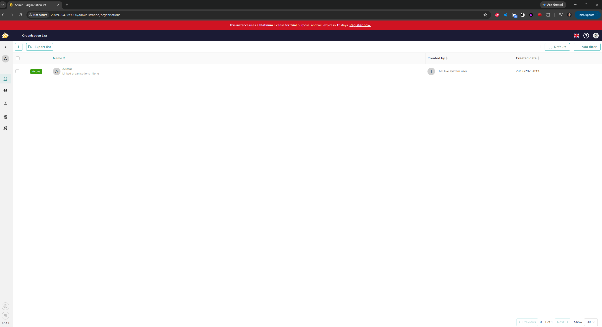

TheHive is now configured completely and is running and ready.

## Section 2.2: Configure Wazuh
For this step, we will access the Wazuh dashboard from inside the Windows VM so we can deploy and install the Wazuh agent directly on the test machine being monitored. This allows the Windows VM to register with the Wazuh manager and begin sending telemetry for detection and alerting.

Since our Wazuh Server is publicly available, we can enter https://20.205.120.231/ in the URL field our browser within the Windows 11 VM. We can use the default credentials of Wazuh to log in.


We are greeted with Wazuh's dashboard.


Now, we can go to Deploy a new agent. 

We will select Windows MSI 32/64 bits. Set our server address to the Wazuh server's public IP. Set an agent name, for this lab, we'll name it "JethLab-Windows".

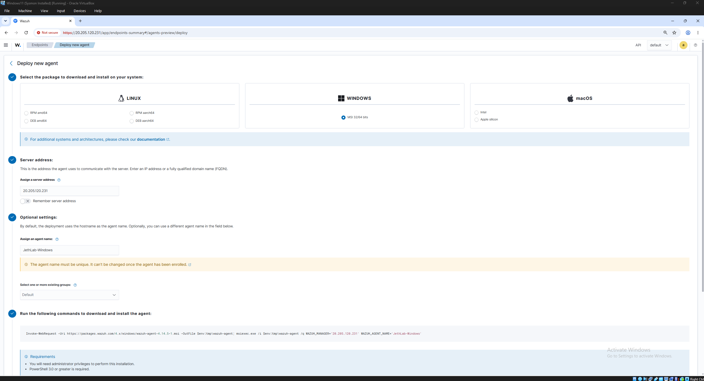

Then we can install the agent inside our VM using the command provided.

    Invoke-WebRequest -Uri https://packages.wazuh.com/4.x/windows/wazuh-agent-4.14.5-1.msi -OutFile $env:tmp\wazuh-agent; msiexec.exe /i $env:tmp\wazuh-agent /q WAZUH_MANAGER='20.205.120.231' WAZUH_AGENT_NAME='JethLab-Windows' 

Then simply start the Wazuh service using the command
    
    net start wazuhsvc


Wazuh uses ports 1515 and 1514, so we must enable these ports both using the UFW in our VMs, and within Azure

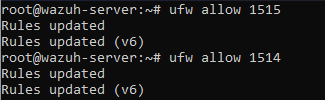

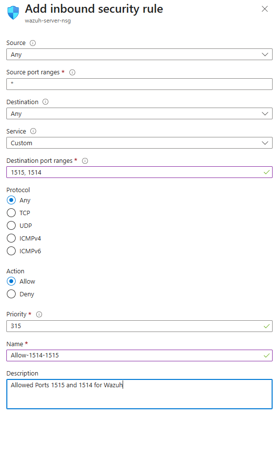

And then restarting the Wazuh Service.
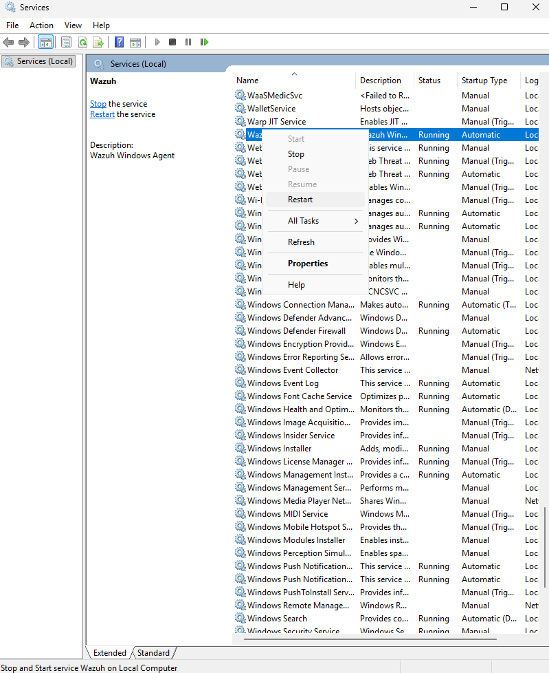

After these configurations, we can now see that we have an active agent in Wazuh, which is our Windows 11 VM.

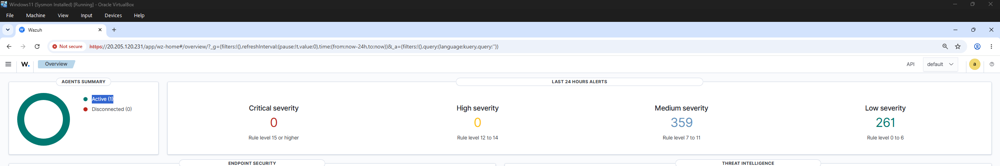

Now our Wazuh is configured correctly and ready. We can now perform further configurations to prepare it for sysmon telementry, which we will cover in the next section.

# Section 3: Sysmon Telemetry and Alert Detection

In this section, we will configure the Windows 11 VM (our endpoint) to forward Sysmon telemetry to Wazuh. This allows Wazuh to collect detailed Windows event data such as process creation activity, command execution, and endpoint behavior. After confirming that Sysmon logs are being ingested, we will configure Wazuh archive logging and create a custom detection rule for suspicious credential-dumping activity.

## Section 3.1 Configure the Windows Wazuh Agent to Collect Sysmon Logs
Here we will be modifying the Wazuh agent configuration on the Windows 11 VM.

The Wazuh agent configuration file is located at:

    C:\Program Files (x86)\ossec-agent\ossec.conf   

Inside the ossec.conf, we go to the log analysis section and configure the agent to collect Sysmon Operational logs. To do this we must copy the full event channel of Sysmon, which we can get through Event Viewer -> Windows -> Sysmon


The Sysmon event channel is:
Microsoft-Windows-Sysmon/Operational

We will plug this in in our ossec.conf file for Wazuh to ingest logs from Sysmon. Specifically, this tells the Wazuh agent to collect logs from the Sysmon Operational event channel and treat them as Windows Event Channel logs.


Since we edited Wazuh's configuration file, we must restart the service again.

Going to the Discover window in Wazuh, and filtering our results using the keyword "sysmon". We can inspect one event and see that the provider name is indeed Windows Sysmon. 


This validates that Wazuh does indeed ingest logs from Sysmon

## Section 3.2 Prepare Mimikatz


For this lab, we will use Mimikatz to generate malicious telemetry. 

Mimikatz is a well-known credential-dumping tool often used by attackers after gaining access to a Windows system. This allows us to validate whether Sysmon and Wazuh can identify suspicious process execution and trigger a custom security alert.

For this to work we must turn off Windows Defender within our VM.


We can now download a copy of Mimikatz from a Github repository, specifically this one is maintained by gentilkiwi


After extracting this download, we can open the folder containing mimikatz.exe then open powershell from there, or alternatively open powershell and cd into that directory. Either way, we can execute mimikatz.exe using the command
        
    .\mimikatz.exe


Now that we ran mimikatz.exe, this must show in Wazuh. But if we searched for Mimikatz, no results would appear, if we were under the index of "wazuh-alerts". 


This is because no custom rules has been set up yet to generate an alert of this type of activity from Mimikatz (setting up custom rules in Wazuh is one of our goals for this lab, and will be done later)

## Section 3.3 Setting Up Archives in Wazuh

Before creating custom detection rules in Wazuh, we will first have to do some configuration in our Wazuh server VM through SSH.

We will change logall from no to yes, and do the same for logall_json


With this, we are enabling Wazuh to save all received logs. This is needed because Mimikatz activity may appear first as raw Sysmon telemetry, but not yet as a Wazuh alert (until we create a custom rule).

Since we changed Wazuh's configuration, we must again restart the service. Also within the SSH session to our Wazuh server, we can enter.

    systemctl restart wazuh-manager.service


(This restarts the Wazuh manager service on the Ubuntu Wazuh server, not on the Windows VM).

Since we enabled logall, we can verify that Wazuh is logging everything, specifically in the folder /var/ossec/logs/archives. We can list down this folder's contents using the command

    cd /var/ossec/logs/archives
    ls -la


Next thing to configure is filebeat.yml. We can use nano to edit this. 

    nano /etc/filebeat/filebeat.yml


Filebeat is the service that forwards Wazuh log files into the Wazuh indexer so we can search them in Discover later.

So we must enable the "archives" module so raw Wazuh archive logs can be indexed and searched in the dashboard. This lets us find Sysmon events, such as Mimikatz execution.


Then since we edited the configuration file of filebeat, we must also restart this service


Now our manager configurations are completed. 

Now we must create a new index, back in Wazuh. To do this, go to Dashboard Management -> Index patterns -> Create index pattern

An index is a storage location for logs and alerts. Wazuh stores different types of data in different indexes. Creating or selecting the right index lets us search the correct data in the dashboard.

Then we can search for the Wazuh archive logs, by matching the index pattern. 


Wazuh will ask us for a time field after this, we can select timestamp to sort and filter the logs by time. Then we can create the index pattern.


Going back to Discover, we can see that we now have a new index, wazuh-archives*


Ultimately, creating the new wazuh-archives-* index allowed us to view raw logs. 

Before this, Wazuh was only showing events that were triggered by alerts (in wazuh-alerts index), it was harder to view raw Sysmon telemetry. By enabling archives and creating the mew wazuh-archives* index, we are able to view raw telemetry, which we could use to create a custom rules to turn raw events into alerts.

To verify this, we can run mimikatz.exe again, and monitor the alerts from wazuh-archives. Now we can see that running mimikatz.exe did indeed generate telemetry, which we can view under wazuh-archives*.


## Section 3.4 Setting Up Custom Detection Rules in Wazuh

We can now create custom detection rules around the raw logs that we set up previously.

Specifically, for this lab we will create a rule that will **detect Mimikatz execution**.

To do this, go to Server Management -> Rules -> Custom Rules -> Edit rule

Here, we will be writing the rule that will actually detect mimikatz execution. The rule written for this is

```xml 
<rule id="100002" level="15">
<if_group>sysmon_event1</if_group>
<field name="win.eventdata.originalFileName" type="pcre2">(?i)mimikatz\.exe</field>
<description>Mimikatz Usage Detected</description>
<mitre>
    <id>T1003</id>
</mitre>
</rule>
```

This custom rule tells Wazuh: “If a Sysmon process creation event shows mimikatz.exe", generate a high-severity alert.

```xml 
<rule id="100002" level="15">
```
 - Creates a custom Wazuh rule. The id uniquely identifies the rule, while level="15" makes it a high-severity alert.

```xml 
<if_group>sysmon_event1</if_group>
``` 

  - Limits the rule to Sysmon Event ID 1, which is process creation. This means the rule is looking for a program being executed on the Windows endpoint.

```xml 
<field name="win.eventdata.originalFileName" type="pcre2">
```

 - Checks a specific Sysmon field: the executable’s original file name. type="pcre2" means Wazuh will use regex pattern matching.

```xml 
(?i)mimikatz\.exe
```
 - This is the detection pattern. (?i) makes it case-insensitive, so it can match mimikatz.exe, Mimikatz.exe, or other case variations. The \. means the dot is treated as a real period, not a regex wildcard.

```xml 
<description>Mimikatz Usage Detected</description>
```
 - This is the alert name that appears in Wazuh when the rule triggers.

```xml 
<mitre><id>T1003</id></mitre>
```
 - Maps the alert to MITRE ATT&CK technique T1003: OS Credential Dumping, which is the behavior commonly associated with Mimikatz.

 We must save this rule then reload for it to take effect. 

To check if our rule works, we can run mimikatz.exe again, then check under wazuh-alerts.


We can see that we do have 1 hit from our wazuh-alerts index after running mimikatz.exe again. Inspecting this alert, the rule description is Mimikatz Usage Detected.

This means that we have succesfully created a custom detection rule! Since this appeared under wazuh-alerts and not wazuh-archives, and that it shows the correct rule name.

All that's left now is SOAR integration and automation, which we will cover in the next section.

# Section 4: SOAR Integration and Automation

This is the last part of this lab, here we will be combining all the tools we have set up previously and integrating all of them in a SOAR. The SOAR to be used in this lab is Shuffle.

## 4.1 Create a Shuffle Workflow

We begin by creating a new workflow in Shuffle. This workflow acts as the SOAR playbook that receives alerts from Wazuh and performs automated actions.

Here we have our blank workflow, starting from scratch.


The first component added to the workflow is a Webhook. The webhook provides a unique URL that Wazuh can send alerts to. 

This is the entry point of the automation. When the custom Wazuh rule triggers, Wazuh sends the alert data to this Shuffle webhook.

## 4.2 Configure Wazuh to Send Alerts to Shuffle

Next, we configure the Wazuh manager to forward the custom Mimikatz alert to Shuffle.

We edit the Wazuh manager configuration file:

    sudo nano /var/ossec/etc/ossec.conf

Inside the configuration, we add a Shuffle integration block:


```xml
<integration> <name>shuffle</name> <hook_url>[WEBHOOK_URI]</hook_url> <rule_id>100002</rule_id> <alert_format>json</alert_format> </integration>
```
This configuration connects Wazuh to Shuffle and ensures that only the specific custom alert is sent into the automation workflow.

```xml
<name>shuffle</name>
```
 - Specifies that this integration sends alerts to Shuffle.

```xml
<hook_url>
```
 - Contains the Shuffle webhook URL where Wazuh will send the alert.

```xml
<rule_id>100002</rule_id>
```
 - Limits forwarding to our custom Mimikatz detection rule only.

```xml
<alert_format>json</alert_format>
```
 - Sends the alert in JSON format so Shuffle can parse the fields properly.

 ## 4.3 Verify Alert Delivery to Shuffle

After starting the integration, we can trigger the custom Mimikatz alert again inside the Windows lab VM by running mimikatz.exe.

Once the alert triggers, we can check Shuffle’s workflow runs. The webhook should receive a Wazuh alert containing the custom rule details, host information, event data, and the full raw log.

We can see a new run


This confirms that Wazuh is successfully sending the custom alert to Shuffle. At this point, the detection pipeline is no longer limited to Wazuh; it can now trigger automated response actions.

## 4.4 Extract a SHA256 Hash from the Alert

After confirming that Shuffle receives the alert, we add a Shuffle Tools step to extract the SHA256 hash from the alert data.


The regex used is:
```xml
SHA256=([0-9A-Fa-f]{64})
```
Extracting the SHA256 hash allows the workflow to use the file hash as an IOC  (indicator of compromise). This hash can then be checked against threat intelligence sources such as VirusTotal.
```xml
SHA256=
```
 - Looks for the SHA256 field in the alert data.

```xml
[0-9A-Fa-f]
```
 - Matches hexadecimal characters.

```xml
{64}
```
 - Matches exactly 64 characters, which is the length of a SHA256 hash.

## 4.5 Enrich the Hash with VirusTotal

Next, we add the VirusTotal app to the Shuffle workflow and authenticate it using a VirusTotal API key.

VirusTotal authentication:


After extracting the SHA256 hash from the Wazuh alert, we add the VirusTotal v3 app to the Shuffle workflow. The selected action is: "Get a hash report"

This action sends the extracted file hash to VirusTotal and requests information about it. VirusTotal can return details such as whether the hash has been associated with malicious activity or not.

In the Id field, we input the SHA256 value extracted from the previous regex step:

    $hash.group_0.#

This value represents the captured hash from the Shuffle Tools regex output.

Configuring our VirusTotal in our workflow:


Once configured correctly, VirusTotal enriches the Wazuh alert with external threat intelligence, validating if the has is known to be malicious or not. This gives the us more context about the detected file without having to manually copy and search the hash.

Performing a rerun on our workflow, we can see that VirusTotal succeeded (indicated by the "200" Status)


## 4.6 Prepare TheHive for Case Management

After enrichment using VirusTotal, we configure TheHive so Shuffle can automatically create alerts.

Inside TheHive, we create an organization, we'll name it "JethLab" for the SOC automation lab. We then create two users:

1. Analyst user = used to review alerts in TheHive 
2. Service account = used by Shuffle to create alerts through the API


Creating Analyst User:


Creatingg Servuce Accounting:


Now we have two accounts:


For the service account, we generate an API key.


## 4.7 Connect Shuffle to TheHive

In Shuffle, we add TheHive app and authenticate it using the service account API key.

The TheHive URL is configured as:

    http://<THEHIVE_PUBLIC_IP>:9000


The selected TheHive action is: "Create alert"


We configure the alert fields using data from the Wazuh alert. This JSON configuration defines how Shuffle creates an alert in TheHive after receiving the custom Wazuh Mimikatz detection.

```xml
{
  "description": "$exec.title",
  "externallink": "${externallink}",
  "flag": false,
  "pap": 2,
  "severity": "3",
  "source": "$exec.pretext",
  "sourceRef": "$exec.rule_id",
  "status": "New",
  "summary": "Mimikatz activity detected on Host $exec.text.win.system.computer",
  "tags": ["T1003"],
  "title": "$exec.title",
  "tlp": 2,
  "type": "Internal"
}
```

`description`: Uses the Wazuh alert title as the alert description in TheHive.

`externallink`: Provides a link reference if an external alert or source link is available.

`flag`: Set to false, meaning the alert is not manually flagged by default.

`pap`: Defines the Permissible Actions Protocol level. A value of 2 controls how the information may be used operationally.

`severity`: Sets the severity of the TheHive alert. In this case, 3 marks it as a high-priority alert.

`source`: Uses the Wazuh alert pretext as the alert source, showing that the alert came from Wazuh.

`sourceRef`: Uses the Wazuh rule ID as the source reference, helping track which detection rule generated the alert.

`status`: Sets the alert status to New, meaning it has not yet been reviewed or closed.

`summary`: Creates a short investigation summary and includes the affected Windows host from the Wazuh event data.

`tags`: Adds T1003, which maps the alert to MITRE ATT&CK Credential Dumping.

`title`: Uses the Wazuh alert title as the TheHive alert title.

`tlp`: Defines the Traffic Light Protocol level. A value of 2 indicates controlled sharing.

`type`: Marks the alert type as Internal, meaning it came from an i nternal detection source.

Overall, this configuration turns the Wazuh detection into a structured TheHive alert.

This shows our topology so far:


To verify our workflow so far, we can run mimikatz.exe again in the Windows VM, which activates the workflow.


This validates that Shuffle can automatically create a TheHive alert from a Wazuh detection. This completes the alert handoff from SIEM detection to case management.

## 4.9 Add Email Notification to SOC Analyst

Finally, we add an email notification step in Shuffle. This sends a message to the SOC analyst when the Mimikatz detection workflow runs.


The email action is configured with the recipient email address, subject, and body.

```xml
Recipient: <analyst_email>
Subject: SOC Automation Project Test
Body: If you're receiving this email, your project worked.
```

The email notification gives the analyst an external alert outside of Wazuh, Shuffle, and TheHive. This helps ensure that important detections are brought to the analyst’s attention outside of their SIEM and SOAR.

This leaves us with our final workflow:

This final Shuffle workflow connects the full SOC automation path: the Wazuh alert enters through the webhook, Shuffle processes the alert and sends the extracted hash to VirusTotal for enrichment, then the workflow branches into TheHive for alert/case creation and Email for analyst notification. The green connections show that the actions are properly linked in sequence, so the final run should validate the complete pipeline: detection from Wazuh, enrichment through VirusTotal, case management in TheHive, and notification through email.


Again, running mimikatz.exe on the Windows VM. We confirm that the email notification is successfully delivered to the configured recipient inbox.

The received email shows that the Shuffle email action executed correctly and that the automation can notify an analyst when the workflow is triggered.


# Final Outcome
After completing the lab, we successfully built an end-to-end SOC automation workflow. The Windows endpoint generates Sysmon telemetry, Wazuh detects suspicious Mimikatz activity using a custom rule, and Shuffle receives the alert through a webhook. The workflow then enriches the file hash with VirusTotal, creates an alert in TheHive for case management, and sends an email notification to the analyst.

This project demonstrates how SIEM, SOAR, threat intelligence, and case management tools can work together to improve alert handling and reduce manual investigation steps.