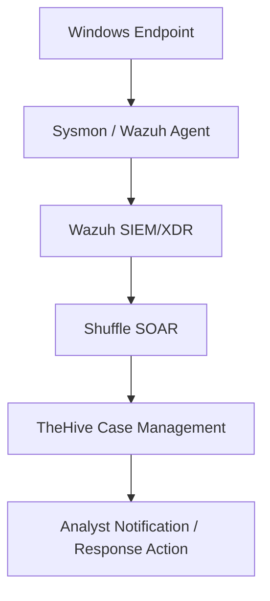
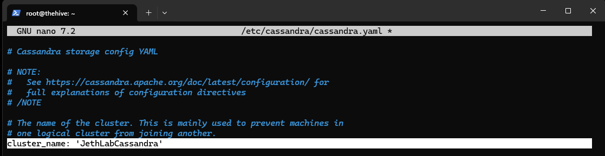
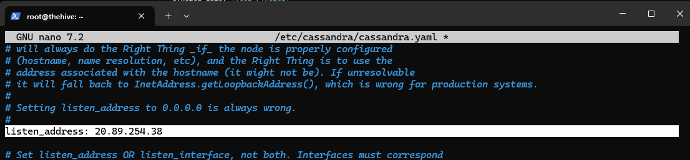
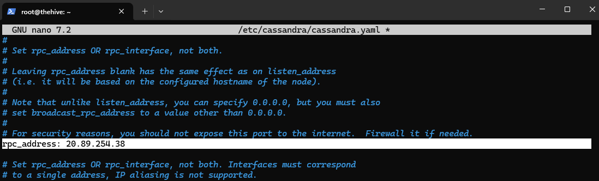
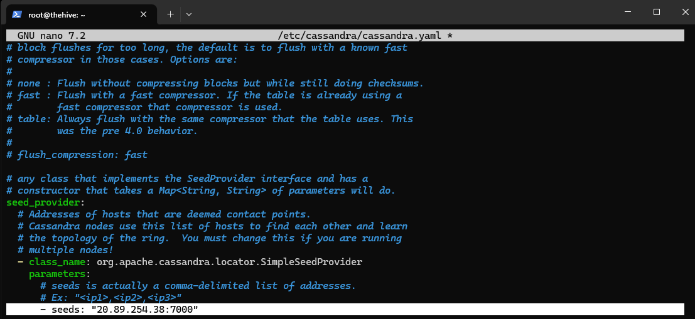
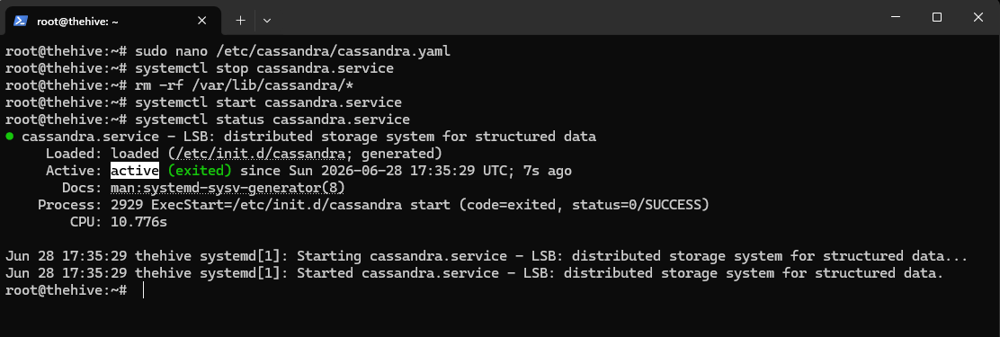
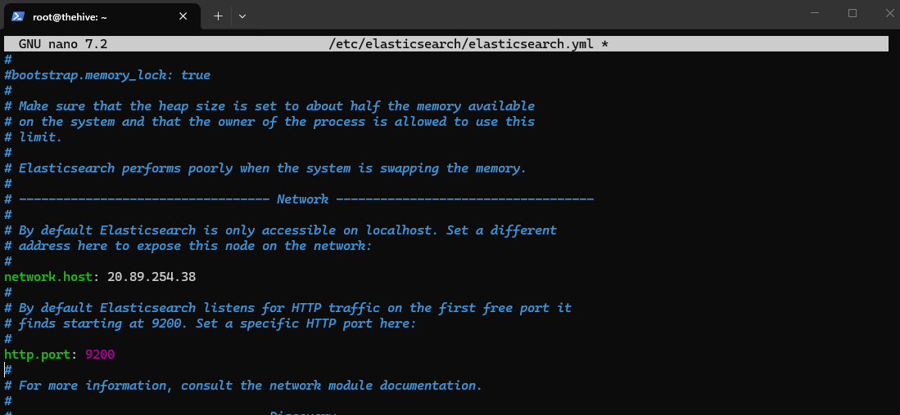
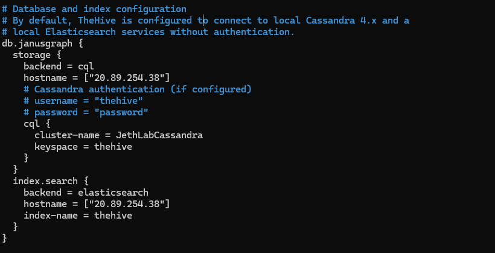
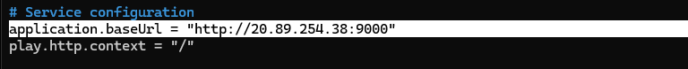

# SOC Automation Lab Project
This SOC automation lab simulates how a security team detects, manages, and responds to alerts. Wazuh is used as the SIEM, TheHive is used for case management, and Shuffle is used as the SOAR to automate the workflow. The lab demonstrates endpoint telemetry, alert generation, case creation, analyst notification, and basic incident response automation.

# Lab Objectives
1. Simulate a SOC workflow from detection to investigation and response
2. Configure Wazuh as the main SIEM/XDR platform (using Azure)
3. Configure TheHive as the case management platform (using Azure)
4. Configure Shuffle as the SOAR
5. USe Mimikatz in a Windows VM to generate malicious telemetry  
6. Use logs from Sysmon

# Lab Roadmap
Basic Flow:

Activity on the Windows endpoint is captured by Sysmon and the Wazuh agent, which send logs to the Wazuh SIEM/XDR for analysis and alert generation. Alerts are then passed to Shuffle, which automates workflows such as creating cases in TheHive. Finally, TheHive organizes the incident for investigation and can trigger notifications or response actions by the analyst.

## Lab Sections
This lab is divided into 4 sections, namely:
### Section 1: Platforms and Endpoint Preparation

Azure virtual machines are created for Wazuh and TheHive, SSH access was configured to configure them. Shuffle is also set up as the SOAR.

### Section 2: Server and Endpoint Configuration

Wazuh, TheHive, and the Windows endpoint are configured so they can communicate with each other.

### Section 3: Telemetry and Alert Generation

This will involve generating endpoint telemetry utilizing Mimikatz and Sysmon and creating alerts in Wazuh.

### Section 4: SOAR Integration and Automation

Integrating Wazuh, TheHive, and Shuffle to automate alert handling, case creation, analyst notification, and possible response actions.

# Section 1: Platforms and Endpoint Preparation
## 1.1. Setup Windows 11 Virtual Machine
A Windows 11 Pro Virtual Machine has been setup in VirtualBox.

Sysmon has also been setup and configured in this VM.

## 1.2 Setup of Wazuh and TheHive in Microsoft Azure  
### 1.2.1 Setup a Resource Group
For this lab Wazuh and TheHive are hosted in Microsoft Azure for convenience and to free up resources in the local machine, as it is already running the Windows VM locally. 

A resource group named "soc-lab-rg" is set up. All our resources including the Wazuh and TheHive servers will be stored here, as well as the virtual networks.

### 1.2.1 Wazuh Server Deployment
For the server that will host Wazuh, an Ubuntu 24.04 LTS VM was deployed. Named wazuh-server and was deployed to have 4 vCPUs and 8 GBs of RAM. This server will host our SIEM/XDR. Initially, SSH is enabled within the network settings of this VM to allow access to the VM using our local machine.

We can take note of the assigned public IP address for this server which is:
    
    Wazuh Server Public IP: 20.205.120.231

### 1.2.2 TheHive Server Deployment
For the TheHive server, a slightly more powerful Ubuntu 24.04 LTS VM was with 16 GB of RAM was used since TheHive requiers heavier backend components and is used for investigation and case tracking. This VM was named thehive. Like the Wazuh server, SSH is also enabled initially for this VM.

We can also take note of the assigned public IP address for this server which is:

    TheHive Server Public IP: 20.89.254.38

## 1.3 SSH Access to Azure-based VMs and Update Ubuntu.

### 1.3.1. Acesss Azure VMs using SSH
To access our Azure VMs from our local machine, we can use secure shell or SSH. An SSH key-based authentication was set up to ensure a secure connection.

SSH key-based authentication uses a pair of cryptographic keys: a private key stored securely on the local machine and a public key placed on the server. When connecting, the server verifies the private key without transmitting it over the network. This approach is more secure than password-based authentication.

To SSH onto our Azure VMs, we can use the command:

    ssh -i <PRIVATE_KEY_FILE>.pem <USERNAME>@<SERVER_PUBLIC_IP>

We used Windows Powershell to enter this command to access both servers. The default username for these is "azureuser". It's also important that when performing this command, we must be in the same directory as the .pem or SSH key. As shown in the screenshots below.

SSH to the Wazuh Server:

SSH to TheHive Server:

### 1.3.2 Ubuntu Updates
Now that we have SSH connection to both our VMs, we can go ahead and update our Ubuntu package repositories. 

We can use the command:

    sudo apt update && sudo apt upgrade -y

 - sudo: Runs the command with administrative (root) privileges
 - apt update: Refreshes the package list from repositories
 - &&: Ensures the next command runs only if the previous one succeeds
 - apt upgrade: Installs available updates for installed packages
 - -y: Automatically confirms prompts to proceed with the upgrade

Wazuh Server Update:

TheHive Server Update:

With this SSH connection and Ubuntu updates, we now have an established connection from our local machine to our updated VMs that we configured earlier in Azure. We can now install our platforms in these VMs and configure them.

## 1.4 Wazuh Installation
Wazuh was installed on the Azure Ubuntu server using the Wazuh installation assistant.

The main command used is:

    curl -sO https://packages.wazuh.com/4.14/wazuh-install.sh && sudo bash ./wazuh-install.sh -a

The screenshot below shows that Wazuh has already been installed. This is because I have already installed Wazuh previously, but no harm in still entering the command.

Wazuh will be used as the main SIEM/XDR component of the lab. It will collect logs, analyze events, and generate alerts from monitored endpoints.

## 1.5 TheHive Installation
Unlike Wazuh, installing TheHive requires more steps.

For the brevity of this document, refer to TheHive website for instructions for steps 1.5.1 - 1.5.4. 

### 1.5.1 Install required dependencies

### 1.5.2 Set up the Java virtual machine (JVM)

### 1.5.3 Install and configure Apache Cassandra

### 1.5.4 Install and configure Elasticsearch

### 1.5.5 Install and configure TheHive
With the previous pre-requisites being installed, we can now download the installation packages for TheHive and finally  install it.

To Install TheHive, use the command:

    sudo apt-get install /tmp/thehive_5.7.3-1_all.deb

## 1.6 Logging Into Wazuh and TheHive
Now that Wazuh and TheHive have been installed, we can try logging into them using our browser.

To login to our Wazuh Server using our web broswer we can simply type in

    https://[WAZUH-SERVER-PUBLIC-IP]

Which for our case is https://20.205.120.231/

However, upon trying this, we can see that we get a timeout error. Meaning our browser cannot connect to our Wazuh Server

To login to our TheHive on the other hand, we can type in

    http://[THEHIVE-SERVER-PUBLIC-IP]:9000

However, like our Wazuh Server, this is giving us a timeout error.

So we must troubleshoot to figure out what is causing this and fix the issue.

### 1.6.1 Troubleshooting Wazuh and TheHive Servers

### 1.6.1.1 Firewalls

The first thing to check if there is a Firewall set up in our virtual network within Azure.

To do this we can simply go to Azure Portal -> Virtual Networks -> [virtual-network] -> Settings -> Firewall

For both our Vnets, there are no firewalls that exist. So we can eliminate this potential cause.

 

### 1.6.1.2 Check if Services are Running

A possible reason for our timeout is simply that Wazuh and TheHive are simply not running. We can verify these services are running using the commands: 

    systemctl is-active <service-name>

 - systemctl = controls/checks Linux system services.
 - is-active = checks if a service is currently running.
 - service-name = the service you want to check, like thehive, cassandra, or wazuh-manager.
 - active = service is running.
 - inactive = service is installed but not running.
 - failed = service tried to run but encountered an error.

This checks whether a Linux service is currently running.

For the Wazuh server, we can see that the Wazuh services are running, so no issue here.  

Verifying if Wazuh service is running:

Also for the TheHive server, we can see that all the required services are running.

Verifying that TheHive service is running:

So we have confirmed that the services are actively running, so we can eliminate this potential issue.

### 1.6.1.3 Verify if HTTPS port is Enabled
Another possible cause of the timeout issue is that HTTPS traffic is not allowed in our Azure Network Security Groups. Since the Wazuh and TheHive dashboards are accessed through HTTPS, port 443 must be enabled. If this inbound port is blocked, the browser will not be able to reach the Wazuh and TheHive servers even if the services are  running properly and no firewalls are set up.

To do this we can configure our VM network settings in Azure. Go to Azure Portal -> Virtual Machine -> Network Settings

Inspecting our current network settings, we can see that SSH or port 22 is the only inbound port enabled. No wonder we can't connect to our Servers via HTTPS, but can access it via powershell using SSH.

Our inbound port rules for TheHive VM, the same issue exists. So the next step is to simply add a rule to allow inbound HTTPS (port 443) traffic, to be safe we can also enable HTTP (port 80).

In the same window, we can simply click on "Create port rule" and configure our settings.

Now, we can see that inbound traffic to port 443 or HTTP has been enabled for the network group. 

We can perform the same configurations for the TheHive VM. 

### 1.6.2 Check if we can now login to Wazuh and TheHive

Entering https://[WAZUH-SERVER-PUBLIC-IP] onto our URL field in our browser, we can now access our Wazuh server. 

We have successfully troubleshooted our timeout error earlier for our Wazuh Server. The cause of the problem was that inbound HTTPS traffic was blocked in our VMs' network security groups. Enabling this port solved our problem. 

Although for now, we still can't access TheHive through our browser, a timeout error still persists at this point. That is because additional configuration must still be done, which we will be doing in the next section

# Section 2: Server and Endpoint Configuration

This section focuses on configuring the deployed servers and endpoint so they can begin communicating with each other.

## Section 2.1: Configure TheHive
In this section of the lab, we will configure TheHive and its required backend services (Cassandra and Elastisearch) so it can function as the case management platform for our SOC environment. We will update Cassandra, Elasticsearch, and TheHive’s application configuration to use the correct server settings.

### Section 2.1.1 Configuring Cassandra for TheHive

To configure Cassandra, we must first open it's main configuration file, using the command:

    sudo nano /etc/cassandra/cassandra.yaml

 - sudo = run as admin/root
 - nano = text editor
 - cassandra.yaml = Cassandra config file

 We can now change our "cluster_name" to personalize it. For this lab, I just chose to name it "JethLabCassandra"

 

 Then we can change our Listening Address, since the Cassabdra .yaml configuration file contains hundreds of lines, to make our work easier, we can use "Where Is" to find the word listen in our conf file, using the hotkey "^W". 
 
 We can change our listen_address from "localhost" to the public IP address of our TheHive Server which is "20.89.254.38"

 This tells Cassandra what network address to listen on.

 
 
 Next we must change our rpc_address, using the same hotkey ("^W"), to find it in our config file. We must also change this to the public IP address of the TheHive server.

 RPC is how applications, like TheHive, communicate with Cassandra.

 

Lastly, we must configure our seed. Again, we just change this to the public IP address, but maintaining the default port.

The seed tells Cassandra where the main node is. Since this is a single-server lab, it points to itself.

 

 Now we can finally save our cassandra configuration file by pressing ^X to exit, then Y to save the file, then just press enter. 

 To properly implement our changes, we must first stop the cassandra service, using the command
    
    systemctl stop cassandra.service

This stops Cassandra before applying the new config.

 - systemctl = manages Linux services
 - stop cassandra = stops the Cassandra service

 Then we must remove the old Cassandra database files. We must do this  because changing the cluster name can conflict with the old stored data.

    sudo rm -rf /var/lib/cassandra/*

 - sudo = runs the command with administrator/root privileges.
 - rm  = removes/deletes files or folders.
 - -r = deletes folders and everything inside them.
 - -f  = force deletes without asking for confirmation
 - /var/lib/cassandra/*  = targets all contents inside Cassandra’s data directory, but not the folder itself.

 Now we can start the Cassandra service using the command

    systemctl start cassandra.service

Which is similar to the previous stop command, but changing "stop" for "start". This simply starts the service. 

Then we can verify the status of our service using

    systemctl status cassandra.service

### Section 2.1.2 Configuring Elasticsearch for TheHive

Similar to our Cassandra configuration, we must first open the elasticsearch config file. We can use the command

    nano /etc/elasticsearch/elasticsearch.yml

Again, like in our Cassandra config, the next step is to change our cluster name. 
We can uncomment the cluster-name line and rename it. To follow our previous naming style in Cassandra, I'm just going to rename this as JethLabElasticsearch 

We must also uncomment the node.name line. This names this Elasticsearch server as node-1. Since this is only one VM, one node is enough.

Next, we must configure our Network settings. First is to uncomment the network.host line and configure it to our public IP. This tells Elasticsearch what IP address to listen on. 

We must also uncomment the http.port line, this sets the default port of 9200  (the API port) which TheHive will use to talk to Elasticsearch.

Lastly is to configure our cluster, after uncommenting this line, we can remove "node-2" and just leave "node-1" alone. We do this since we only need to have one Elasticsearch node.

Then again just save this file by pressing ^X to exit, then ^Y to save, then press Enter to save the filename.

After editing our configuration file, we can now start and enable our elasticsearch service. Then check the status of this service. Using the same commands as we did during the Cassandra config, but of course, using elasticsearch as the service name in our commands.

### Section 2.1.2 Configuring TheHive

Before proceeding we must change the TheHive directory ownership, which is stored in /opt/thp.

Inspecting this directory, by first using "cd" to change to that directory, then using "ll" to list its contents. We can see that the thehive directory is currently owned by "root root".

We must change this to be owned by "thehive", because currently this directory is only allowed access to the root. This command changes the permissions to the /thp folder, and will allow the TheHive service to properly access its own files.

    chown -R thehive:thehive /opt/thp

 - chown = change owner
 - -R = applies changes to all files/folders inside. Thus changing permissions for the "thehive" directory inside /thp
 - thehive:thehive = owner and group should be thehive
 - /opt/thp = TheHive program directory

 Using the command "ll" to list the contents of this directory again, we can verify that the permissions for the "thehive" directory has been changed to thehive.

 

Now that the directory permissions has been configured. We can now perform the actual configurations for the TheHive service.

Again, like the two previous services, we can edit the TheHive's config file using "nano" and specifying the config file's location. 

    nano /etc/thehive/application.conf

And similar to our previous configs, we must change the hostname to this server's public IP address. 

For Cassandra under this config file, we must set the cluster name to match the previous, which is "JethLabCassandra". 

And also for the Elasticsearch under this config file, the hostname must also be set to our public IP address.

Lastly, we must change the service's application base url by inputting the public IP address and maintaining the default port of 9000. This is the URL we will use later to access TheHive in our browser.

Then again simply exit and save the config file.