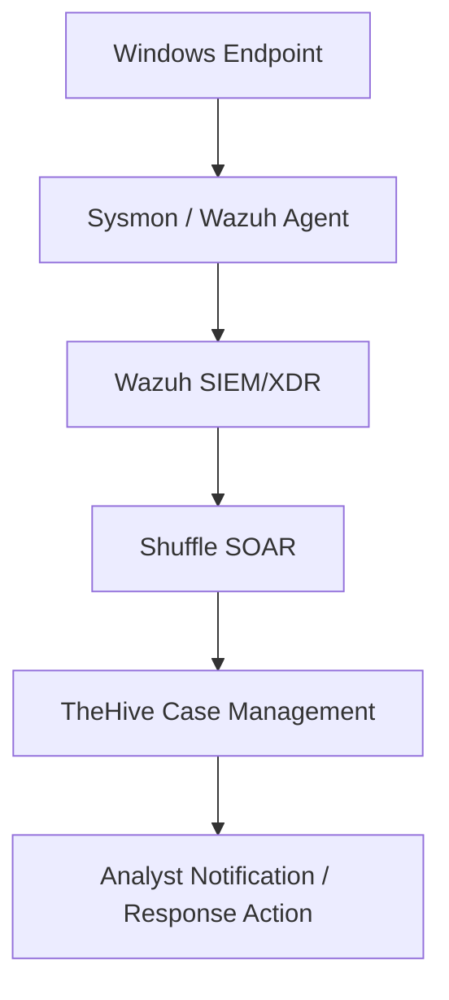

# SOC-Automation-Lab-Project
This SOC automation lab simulates how a security team detects, manages, and responds to alerts. Wazuh is used as the SIEM, TheHive is used for case management, and Shuffle is used as the SOAR to automate the workflow. The lab demonstrates endpoint telemetry, alert generation, case creation, analyst notification, and basic incident response automation.

# Lab Objectives
1. Simulate a SOC workflow from detection to investigation and response
2. Configure Wazuh as the main SIEM/XDR platform (using Azure)
3. Configure TheHive as the case management platform (using Azure)
4. Configure Shuffle as the SOAR
5. USe Mimikatz in a Windows VM to generate malicious telemetry  
6. Use logs from Sysmon

# Roadmap
Basic Flow:

Activity on the Windows endpoint is captured by Sysmon and the Wazuh agent, which send logs to the Wazuh SIEM/XDR for analysis and alert generation. Alerts are then passed to Shuffle, which automates workflows such as creating cases in TheHive. Finally, TheHive organizes the incident for investigation and can trigger notifications or response actions by the analyst.

## Lab Sections

### Section 1: Platforms and Endpoint Preparation

Azure virtual machines are created for Wazuh and TheHive, SSH access was configured to configure them. Shuffle is also set up as the SOAR.

### Section 2: Server and Endpoint Configuration

Wazuh, TheHive, and the Windows endpoint are configured so they can communicate with each other.

### Section 3: Telemetry and Alert Generation

This will involve generating endpoint telemetry utilizing Mimikatz and Sysmon and creating alerts in Wazuh.

### Section 4: SOAR Integration and Automation

Integrating Wazuh, TheHive, and Shuffle to automate alert handling, case creation, analyst notification, and possible response actions.

## Section 1: Platforms and Endpoint Preparation
### 1.1. Setup Windows 11 Virtual Machine