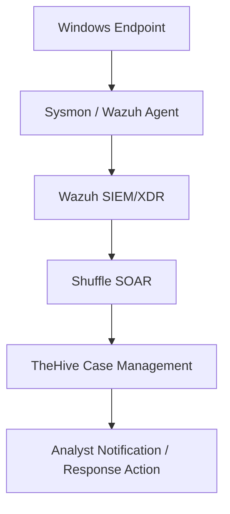
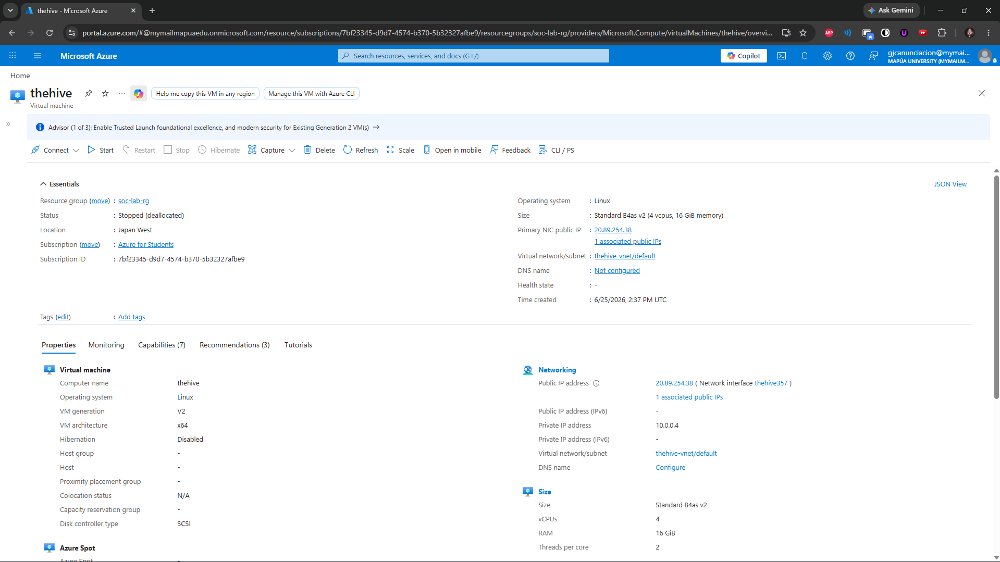
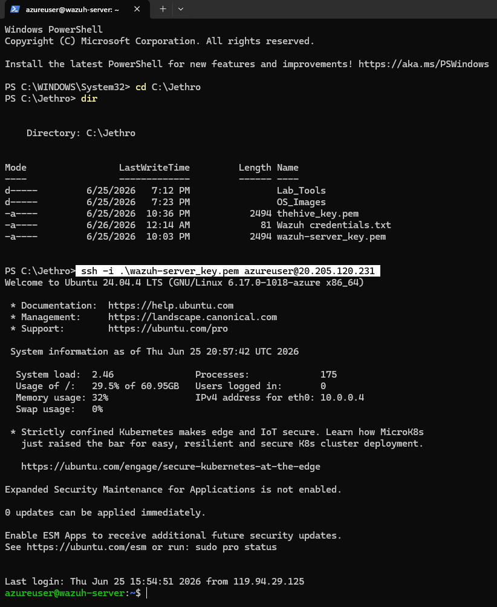
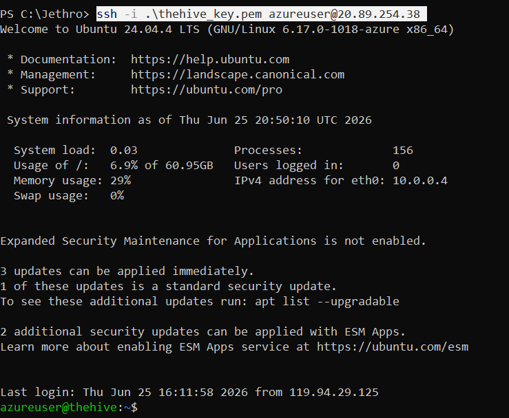

# SOC-Automation-Lab-Project
This SOC automation lab simulates how a security team detects, manages, and responds to alerts. Wazuh is used as the SIEM, TheHive is used for case management, and Shuffle is used as the SOAR to automate the workflow. The lab demonstrates endpoint telemetry, alert generation, case creation, analyst notification, and basic incident response automation.

# Lab Objectives
1. Simulate a SOC workflow from detection to investigation and response
2. Configure Wazuh as the main SIEM/XDR platform (using Azure)
3. Configure TheHive as the case management platform (using Azure)
4. Configure Shuffle as the SOAR
5. USe Mimikatz in a Windows VM to generate malicious telemetry  
6. Use logs from Sysmon

# Lab Roadmap
Basic Flow:

Activity on the Windows endpoint is captured by Sysmon and the Wazuh agent, which send logs to the Wazuh SIEM/XDR for analysis and alert generation. Alerts are then passed to Shuffle, which automates workflows such as creating cases in TheHive. Finally, TheHive organizes the incident for investigation and can trigger notifications or response actions by the analyst.

## Lab Sections
This lab is divided into 4 sections, namely:
### Section 1: Platforms and Endpoint Preparation

Azure virtual machines are created for Wazuh and TheHive, SSH access was configured to configure them. Shuffle is also set up as the SOAR.

### Section 2: Server and Endpoint Configuration

Wazuh, TheHive, and the Windows endpoint are configured so they can communicate with each other.

### Section 3: Telemetry and Alert Generation

This will involve generating endpoint telemetry utilizing Mimikatz and Sysmon and creating alerts in Wazuh.

### Section 4: SOAR Integration and Automation

Integrating Wazuh, TheHive, and Shuffle to automate alert handling, case creation, analyst notification, and possible response actions.

# Section 1: Platforms and Endpoint Preparation
## 1.1. Setup Windows 11 Virtual Machine
A Windows 11 Pro Virtual Machine has been setup in VirtualBox.

Sysmon has also been setup and configured in this VM.

## 1.2 Setup of Wazuh and TheHive in Microsoft Azure  
### 1.2.1 Setup a Resource Group
For this lab Wazuh and TheHive are hosted in Microsoft Azure for convenience and to free up resources in the local machine, as it is already running the Windows VM locally. 

A resource group named "soc-lab-rg" is set up. All our resources including the Wazuh and TheHive servers will be stored here, as well as the virtual networks.

### 1.2.1 Wazuh Server Deployment
For the server that will host Wazuh, an Ubuntu 24.04 LTS VM was deployed. Named wazuh-server and was deployed to have 4 vCPUs and 8 GBs of RAM. This server will host our SIEM/XDR. Initially, SSH is enabled within the network settings of this VM to allow access to the VM using our local machine.

We can take note of the assigned public IP address for this server which is:
    Wazuh Server Public IP: 20.205.120.231

### 1.2.2 TheHive Server Deployment
For the TheHive server, a slightly more powerful Ubuntu 24.04 LTS VM was with 16 GB of RAM was used since TheHive requiers heavier backend components and is used for investigation and case tracking. This VM was named thehive. Like the Wazuh server, SSH is also enabled initially for this VM.

We can also take note of the assigned public IP address for this server which is:

    TheHive Server Public IP: 20.89.254.38

## 1.3 SSH Access to Azure-based VMs and Update Ubuntu.

### 1.3.1. Acesss Azure VMs using SSH
To access our Azure VMs from our local machine, we can use secure shell or SSH. An SSH key-based authentication was set up to ensure a secure connection.

SSH key-based authentication uses a pair of cryptographic keys: a private key stored securely on the local machine and a public key placed on the server. When connecting, the server verifies the private key without transmitting it over the network. This approach is more secure than password-based authentication.

To SSH onto our Azure VMs, we can use the command:

    ssh -i <PRIVATE_KEY_FILE>.pem <USERNAME>@<SERVER_PUBLIC_IP>

We used Windows Powershell to enter this command to access both servers. The default username for these is "azureuser". It's also important that when performing this command, we must be in the same directory as the .pem or SSH key. As shown in the screenshots below.

For the Wazuh Server:

For TheHive Server:

With this SSH connection, we have now established a connection to our VMs we configured earlier in Azure. We can now install our platforms in these VMs and configure them.
